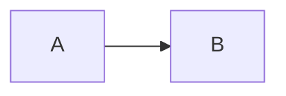

# pandji writes.

A small static journal, built with [Astro](https://astro.build) and Markdown. The homepage lists journals. Opening a journal shows the latest article, then older ones as you scroll, with an index on the left.

## Write

**New journal** — add a Markdown file in `src/content/journals/`. The filename is the URL slug. A stable abstract mark is assigned from the slug; set `emoji` if you want a specific one.

```md
---
title: Workshop notes
description: Optional one-liner.
order: 3
---
```

**New post** — add a Markdown file in `src/content/posts/`. Point it at a journal slug.

```md
---
title: A post title
pubDate: 2026-08-25
journal: workshop-notes
---

Write in Markdown. Use fenced code blocks for code.
```

## Diagrams and circuits

Use a `mermaid` fence for flowcharts, sequences, and simple block diagrams:

````md

````

Mermaid is enough for ideas. Breadboard photos, KiCad schematics, and Fritzing layouts should be images in `src/assets/` or `public/`.

## Commands

| Command           | Action                 |
| ----------------- | ---------------------- |
| `npm run dev`     | Local server           |
| `npm run build`   | Production build       |
| `npm run preview` | Preview the built site |

## Deploy

Push the repo to GitHub and import it in [Vercel](https://vercel.com). Framework preset: Astro. Build command: `npm run build`. Output: `dist`.
