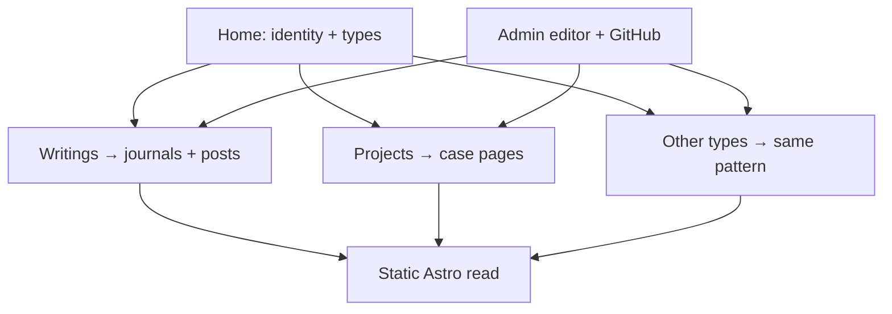

# Portfolio roadmap

Use this site’s stack as the foundation for a personal portfolio — not a second product, and not the multi-tenant `{name} writes.` idea in `the-future-product.md`.

The portfolio is still one personal Astro site, Markdown on disk, admin that commits to GitHub, Vercel rebuild. What changes is the **shape of the home** and a small set of **content types** so writings, projects, and later kinds of work can live together without turning the journal into a CMS.

Do not build this yet. This is a note for later.

## Why this stack

The journal already has the hard parts of a quiet personal site:

- Astro content collections and static reading
- Journals as rooms, posts as a dated feed
- Markdown editor with preview, drafts, images, Mermaid
- Admin auth + GitHub write path
- Marks, plain empty states, light/dark, type that feels like writing

A portfolio should **reuse that foundation** and add presentation for work that is not a chronological post. It should not restart as a page builder, a Notion export, or a theme marketplace.



## Keep

- Markdown files under `src/content/` as the source of truth
- Astro collections + Zod schemas
- The existing journal/post reading experience for writing
- The admin editor for long-form Markdown
- Quiet type, marks, light/dark, empty states that feel intentional
- GitHub commit → Vercel rebuild for a single author

## Change

- Site identity: from **pandji writes.** alone toward a home that can hold **writing and work** without pretending everything is a journal entry
- Homepage: not only a list of journals; an entry that surfaces types (writings, projects, …)
- Content model: more than `journals` + `posts`
- Layouts: writing stays a scrollable feed; projects get their own page shape
- Admin: create/edit by type, not only “new journal / new post”

## Content model

One site. Several **types**. Each type has its own collection (or a clear discriminator), schema, routes, and default layout. Do not force projects through the journal feed schema.

### Writings (already here)

Keep journals and posts as they are.

| Piece | Role |
| --- | --- |
| Journal | A room / series |
| Post | Dated Markdown entry in a journal |

Writings remain chronological. Marks, left index, and the feed stay.

### Projects (first new type)

A project is a **piece of work**, not a dated log entry.

Suggested collection: `src/content/projects/*.md`

```yaml
---
title: Spatial AI sketchbook
summary: Short line for indexes and cards-that-are-not-cards.
year: 2025
status: shipped | wip | archived
featured: true
cover: /uploads/spatial-cover.jpg
links:
  - label: Live
    href: https://…
  - label: Repo
    href: https://…
tags: [interaction, hardware]   # optional, keep sparse
order: 1                        # optional manual sort
draft: false
---

Body is the case write-up: intent, process, outcome. Same Markdown toolbar.
```

Public routes (illustrative):

- `/work` — list of projects
- `/work/{slug}` — project page
- Writings stay under `/journals/…`

Projects may link to related journal posts later (`relatedPosts: […]`). That is optional glue, not a requirement for v1.

### Other types (deliberately open)

Expect more kinds without redesigning the site each time. Candidates, not commitments:

| Type | Feels like | Likely needs |
| --- | --- | --- |
| Note / fragment | Short writing outside a journal | Title, date, body; lighter layout |
| Talk / lecture | Event artifact | Date, venue, slides/video link |
| Making / object | Physical piece | Photos, materials, year |
| Reading / list | Curated set | Links, short annotations |
| About | Single page | Rarely a collection |

Rule for adding a type:

1. Name it (noun people would say out loud)
2. Give it a Zod schema and a folder under `src/content/`
3. Give it one index route and one detail route (or a single page if it is singular)
4. Decide whether admin gets a form, the Markdown editor, or both
5. Decide whether it appears on the home composition

Do not invent a generic “entries with arbitrary fields” CMS. New types should stay few and intentional.

## Information architecture

First viewport of the portfolio home should read as **one composition**: brand/name, one line of what this is, and a clear way into writings and work. Not a dashboard of stats, tags, and promo strips.

```text
pandji.                    (or a deliberate rename — decide before ship)
one short sentence

Writings                   Work
  essays                     project A
  ix3                        project B
  …
```

Alternate: keep **pandji writes.** as the writing surface and treat the portfolio home as a thin front door that links into writings and work. Either way, writing and projects share stack and admin, not necessarily the same URL brand forever.

Nav stays minimal: home, writings (or journals), work, maybe about. No mega-menu.

## Technology map

| Layer | Reuse | Extend |
| --- | --- | --- |
| Astro + Vercel | Yes | New static routes per type |
| `content.config.ts` | Yes | Add `projects` (and later types) |
| `lib/content.ts` | Yes | Typed getters (`getProjects`, filters) |
| Markdown editor | Yes for long copy | Project metadata fields beside the body |
| Image upload → `public/uploads/` | Fine for covers and stills | Blob/CDN only when audio/video or large galleries appear |
| Admin auth + GitHub commits | Yes for solo portfolio | Multi-author is a different roadmap |
| Marks / empty states / theme | Yes | Project pages can stay quieter — avoid card grids that fight the writing aesthetic |

Git-as-CMS remains right for one person’s portfolio. Switching writes to a database is optional later and is **not** required to ship writings + projects.

## Phases

### 0 — Decide identity

- Is the public name still **pandji writes.**, or a broader personal site with writing inside it?
- Domain and homepage sentence
- What types exist on day one: **writings + projects** only

### 1 — Projects collection (thin)

- Add `projects` collection + schema
- `/work` and `/work/[slug]` with a quiet list + case layout
- Seed 2–3 real projects as Markdown
- No admin yet; edit files by hand if needed

Done when: a visitor can move between writings and work without the site feeling like two themes bolted together.

### 2 — Home as portfolio door

- Replace journal-only homepage with a composition that surfaces writings and projects
- Featured projects optional; keep the first viewport sparse
- Breadcrumbs / trail that work across types

Done when: removing the nav still leaves an obvious personal brand and two clear content paths.

### 3 — Admin for projects

- Create / edit / draft projects from `/admin`
- Reuse Markdown editor for the body; simple fields for year, status, cover, links
- Same GitHub commit path as posts
- History / drafts behave like writings where it is cheap to share

Done when: a project can be published without opening the repo.

### 4 — Cross-links and polish

- Optional related posts on projects (and vice versa)
- Covers and responsive images good enough for still work
- RSS for writings first; optional `/work/rss.xml` later
- 404 and empty states that match each type

### 5 — Next types (only when needed)

Add one type at a time using the rule above. Prefer shipping a real Talk or Making page over abstract “custom content type” infrastructure.

## Media

- **Now:** inline images and project covers in git / `public/uploads/` (current path)
- **When audio or video matters:** object storage + CDN; keep Markdown references stable (`cover`, `media[]`)
- Do not redesign the editor around a media library until a type actually needs galleries or embeds at scale

## Deliberately later

- Multi-author / collaborative journals (separate concern from this personal portfolio)
- Hosted `{name} writes.` product (`the-future-product.md`)
- Comments, likes, global discovery feed
- Heavy theming, page builders, drag-and-drop layouts
- Tag taxonomies as navigation
- Custom domains per section
- Database-backed CMS for solo use

## What would break the spell

- Treating every project as a journal post with extra frontmatter forever
- A homepage that looks like a SaaS marketing page or a dashboard
- Card grids, stat strips, and floating badges on the hero
- A generic “content item” table that erases type-specific reading
- Making GitHub setup the visitor’s problem (it is only the author’s publish path)
- Building the multi-tenant product under the guise of a portfolio

## First slice, when building starts

1. Identity decision (name + homepage sentence)
2. `projects` collection + `/work` routes
3. Homepage that links writings and work
4. Three real projects in Markdown
5. Then admin for projects

That is enough to live on. Other types wait until something real wants a home.
