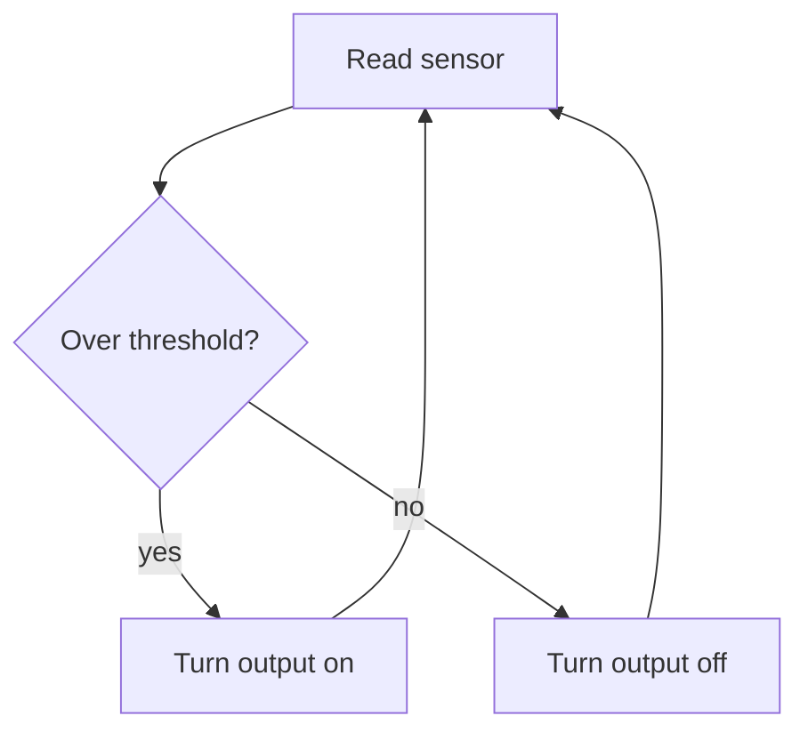

Most physical computing sketches are the same program: read something, decide something, change something.

```cpp
const int sensorPin = A0;
const int ledPin = 9;

void setup() {
  pinMode(ledPin, OUTPUT);
}

void loop() {
  int value = analogRead(sensorPin);
  analogWrite(ledPin, value / 4);
}
```

That loop is the whole architecture. The interesting part is picking the sensor and deciding what “enough” means in the world, not in the code.


