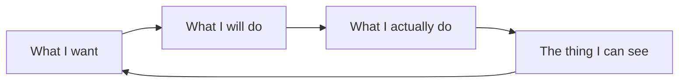

An interface feels usable when the next action is obvious, and the result of that action is obvious too. Don Norman calls the gap between intention and action the gulf of execution.

A useful check while designing: can someone form a goal, see what to do, do it, and know that it worked — without a manual?

If that loop needs extra explanation, the interface is doing too little of the work.
