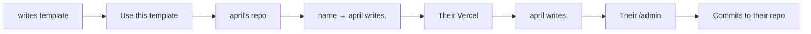

# The future product

An open-source **`{name} writes.`** gift — not a hosted service you maintain.

Friends (and an MDes class) fork or use a GitHub template, set their name, deploy their own site, and get **april writes.** or **bradley writes.** that they own. You distribute the spell; you do not run their journals.

Map of forks: `where-this-could-go.md`. Personal portfolio path: `portfolio-roadmap.md`.

Do not build the packaging yet. This is a note for later.

## Advice: where to take this next

Do **not** start by perfecting upgrades or a monorepo. Sequence:

1. **Unblock naming in this repo** — move `pandji writes.` out of hardcoded `site.ts` into config/env. Personal site keeps working; the gift needs the same seam.
2. **Pick a lane for the next real build** — either live on the portfolio (`portfolio-roadmap.md`) *or* package the gift for 2–3 friends. Not both at once.
3. **When gifting:** create a **separate template repo** (see below), not a long-lived branch inside `pandji-writes`.
4. **Treat class v1 as a snapshot** with semver tags. Build a fancy upgrade path only after someone asks to upgrade.

Smallest useful step from here: site name as config. That helps you either way.

## Naming the gift

| Layer | Name | Notes |
| --- | --- | --- |
| **Project / gift** | **writes.** | Spoken “writes.” The period is part of the brand; matches how sites read. |
| **GitHub repo** | `writes` | No trailing dot in the repo slug. Template: enable “Template repository.” |
| **Each site** | `{name} writes.` | `april writes.`, `bradley writes.`, `pandji writes.` — unchanged. |
| **npm / packages (later)** | `@writes/…` only if you extract shared code | Don’t create packages until upgrades hurt. |

Avoid: “Writes CMS,” “Writes.js,” or naming the template after yourself (`pandji-writes-template`). The gift is the pattern; your site is one instance.

`writes.` is enough. If GitHub `writes` is taken, prefer `writes-template` or `get-writes` over a cute misspelling.

## Two repos (yes) — extract, don’t fork-with-history

**Yes: one repo for you, one for the gift.** They should diverge on purpose.

| Repo | Role | Grows into |
| --- | --- | --- |
| **`pandji-writes`** | Your living site | Portfolio types, kin/motifs, personal content, experiments |
| **`writes`** | Public GitHub template | Journals + desk only; sample content; class README; versioned releases |

Do **not** “Fork” `pandji-writes` on GitHub to make the gift — that copies your journals, issues, and history into everyone’s starting point. **Extract:** new repo, copy the app shell (Astro, admin, styles, empty/sample content), strip personal posts, enable Template.

```text
pandji-writes          writes (template)
    │                      │
    │  shared desk ideas   │
    │◄──── backport ───────┤  (or develop desk fixes on writes first)
    │                      │
    ▼                      ▼
 portfolio features     classmates' repos
 (stay here only)       (from "Use this template")
```

**Feature discipline (this is the real version-control strategy):**

- **Desk / gift features** (editor, empty states, auth, marks, deploy docs) → land in `writes` (or land here then **actively backport** to `writes` in the same sitting).
- **Portfolio features** (projects, home composition, kin) → `pandji-writes` only. Classmates who want that follow the portfolio roadmap on their own fork later.

Your personal site may run *ahead* of the template. That is fine. The template is the supported gift surface; `pandji-writes` is allowed to be weird.

## Versioning and “upgrades”

Classmates do not get App Store updates. They get **git repositories**. Be honest about that in the README.

### v1 (class / friends) — snapshot gift

- Tag releases on `writes`: `v0.1.0`, `v0.2.0`, …
- Keep a short `CHANGELOG.md` (what improved in the desk).
- Default story: *you received a working journal for this semester.* Copy your `src/content/` and `public/uploads/` if you ever start over from a newer template.
- Optional advanced appendix: add `writes` as `upstream`, fetch a tag, merge — expect conflicts in app code; content folders usually fine. Not required for MDes success.

**Do not promise** one-click upgrade in v1.

### When upgrades become real pain (later)

Only if people keep sites for a long time and ask for desk improvements:

1. **Documented upstream merge** — good enough for a few friends who can git.
2. **Extract shared package** (`@writes/desk` or similar) — their repo is mostly content + thin config; `npm update` brings desk fixes. More engineering; best upgrade UX; do this only after (1) is annoying.

Until then, growing features on `pandji-writes` without backporting means **friends do not get them.** That is the tradeoff. Either backport desk work to `writes` releases, or accept drift.

### Practical habit

When you build something on your site, ask once: *Is this desk or portfolio?*

- Desk → release on `writes` (even a patch tag) when you want friends to have it.
- Portfolio → stay private to `pandji-writes`.

## Shape



Each person gets **one site, one repo, one deploy**. Git-as-CMS stays — it is the right model when each writer owns their files. The gift is making spin-up boring enough for classmates: template → name → env → deploy → first post.

This is the opposite of a multi-tenant host. No shared database. No names to claim on your infrastructure. No on-call for other people’s sites.

A hosted “type your name and you’re live” app remains a different ambition (see Deliberately later). It is not this fork.

## Keep

- `{name} writes.` as the identity (not “April’s Blog”)
- Journals as rooms, posts as a scrollable feed
- Quiet type, marks, light/dark, plain empty states
- Markdown writing with the existing toolbar
- Admin that commits Markdown to *their* GitHub
- Words living as files they can leave with (the repo *is* the export)

## Change (from this personal repo → giftable template)

| Today (pandji writes.) | Gift template |
| --- | --- |
| Hardcoded `pandji writes.` in `site.ts` | Config: display name + author from env or `site.config` |
| `GITHUB_REPO=apandji/pandji-writes` | Their fork / new repo from template |
| Seed journals and posts about your work | Empty or one sample journal; no your content |
| README aimed at you | Short “make it yours” guide for non-git-native designers |
| One living site | Many independent sites that happen to share a lineage |

## Core features of the gift

**Use the template.** GitHub Template Repository (or a clearly documented fork). One click → their repo. Prefer template over “clone and re-origin” so the first step feels like receiving a gift.

**Name it.** One place to set the public identity: `april writes.` Display string and short author name. Slug can default from the name for titles; the URL is whatever they connect on Vercel (`april-writes.vercel.app` is fine for class; custom domain later).

**Deploy path that fits class.** Documented happy path: Template → Vercel Import → set env vars → deploy. Aim for a classmate who has GitHub and a Vercel account to reach a public empty journal without editing application code.

**Write immediately after setup.** `/admin` with username/password in *their* env. Same desk: journals, posts, images, Mermaid, drafts. First journal can be seeded as `journal` or created in admin.

**Own the words by default.** Their Markdown, their uploads, their git history. No lock-in ceremony — leaving is `git clone`.

**It looks like writing, even empty.** Ship the quiet empty states and marks. The gift is the *feel*, not a theme marketplace.

**Class distribution.** A short handout or README section: what this is, why journals-as-rooms, the five setup steps, where to change the name, how to publish a first post, how to share the URL with critique partners. Optional: a tiny gallery page *you* keep of classmates who opt in (links only) — not a network inside the template.

## Connection model (keep thin)

Same three layers as the portfolio thinking — the gift stays on the hard layer.

| Layer | In the gift? | Notes |
| --- | --- | --- |
| **Rooms (journals)** | Yes — core | Membership and navigation. Do not replace with tags. |
| **Metadata** | Minimal | Title, date, draft, journal. No CMS field farm. |
| **Fuzzy links** | Out of scope for v1 | `kin` / motifs are portfolio corpus tools; classmates start with one room and a feed |

If someone grows a large personal corpus, they can follow `portfolio-roadmap.md` on *their* fork. The template should not ship portfolio CMS complexity.

## What you owe friends (and what you don’t)

**You owe:** a clear template, a name config, a setup guide that works, occasional upstream fixes you choose to merge into the template, and the reading/writing feel.

**You don’t owe:** hosting, uptime, password resets, content moderation, a shared directory, or merging every classmate’s feature request into your personal portfolio repo.

Keep the template repo (`writes`) separate from `pandji-writes` when you gift it — your portfolio and the class tool should not share one main branch forever.

## Deliberately later

- Hosted multi-tenant “claim a name on your domain” (different product; you become the host)
- Magic link / passkey auth (env password is enough when they own the deploy)
- One-click deploy button polish, Docker, or non-Vercel paths before the Vercel path is proven in class
- Themes beyond light/dark
- Collaboration / multi-author rooms
- Portfolio types (projects, talks) inside the template
- Motif taxonomies, discovery feed, follows
- A required public registry of all `{name} writes.` sites

Optional later gift: documented upstream merge notes; still later, `@writes/desk` as a package if merge pain is real.

## What would break the spell

Making *you* the host of everyone’s writing. A setup that requires editing five source files to change the name. Shipping a dashboard of other classmates’ posts on their homepage. Turning the template into a mini portfolio CMS. Forcing GitHub expertise beyond “use template + import to Vercel.” Asking them to pay you. Rebuilding *your* personal site on every friend’s experiment.

## First slice, if this is ever packaged

1. ~~Site name/author as config in `pandji-writes`~~ (`SITE_NAME` seam — done).
2. New repo **`apandji/writes`**: extract app shell, no personal posts; enable GitHub Template.
3. Same name config + five-step README (template → Vercel → env → name → first post).
4. Tag `v0.1.0` + short changelog; one sample journal empty of your voice.
5. Hand to 2–3 friends before the whole class.

**Status:** template is prepared and builds locally (`SITE_NAME=april` → **april writes.**). Waiting on an empty public repo at https://github.com/apandji/writes to push `v0.1.0`, then mark it as a Template repository and share the link.

That is enough to gift. Hosting many writers on one app is a different story — only if the template spreads and people ask for zero-setup.
