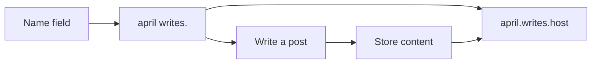

# The future product

A hosted `{name} writes.` product.

The hook is claiming a name and immediately getting a quiet site: **pandji writes.**, **april writes.**, **bradley writes.** Keep the reading and writing feel of this journal. Do not use GitHub as the CMS for other people.

Map of forks and other jumping points: `where-this-could-go.md`. Personal portfolio path: `portfolio-roadmap.md`.

Do not build this yet. This is a note for later.

## Shape

The “type your name” UX only works as **one hosted app**. A clone-your-own-repo template cannot do that. Committing Markdown to GitHub and waiting for a Vercel rebuild is right for one personal site and wrong for many writers.

Ship a **hosted multi-tenant journal**. Someone types `April`, gets **april writes.** at a URL, and can publish a first post in the same sitting. No GitHub, no env files, no deploy wait.

A self-hosted starter is a fine later gift for people who want the files. It is not the “write your name” product.

## Keep

- `{name} writes.` as the identity (not “April’s Blog”)
- Journals as rooms, posts as a scrollable feed
- Quiet type, marks, light/dark, plain empty states
- Markdown writing with the existing toolbar

## Replace

- One hardcoded site name becomes a per-writer name
- GitHub commits become a database
- Shared admin username/password become per-writer sign-in

## Core features

**Claiming a name.** The whole product. One field. First-come. URL slug from the name (`april`, `bradley`). Display stays `april writes.` Reserved words: `admin`, `api`, `www`, `writes`. Names should be letters/numbers, short.

**A public reading URL that is obviously theirs.** `april.writes.example` is stronger than `/april`. Path-based is easier to start; subdomain is the feeling people will screenshot.

**Write immediately.** After the name, they are in the editor, not a dashboard. First journal can be created implicitly (“journal”) or skipped until they need a second room.

**Come back.** Magic link or passkey. Username and password in environment variables will not survive friends. They need to recover the same `april writes.` later.

**Journals + posts.** A few named journals, dated posts, images, links, optional diagram fence. Not tags, not a CMS, not a homepage builder.

**It looks like writing, even empty.** Quiet empty states and marks are not decoration. They are why this is not Substack.

**Own the words.** Export Markdown and images from day one. That is the honest version of “lightweight and open.” People will trust it more if they can leave.

## Connection model (keep thin)

Same three layers as the portfolio thinking — but the product stays on the hard layer first.

| Layer | In the product? | Notes |
| --- | --- | --- |
| **Rooms (journals)** | Yes — core | Membership and navigation. Do not replace with tags. |
| **Metadata** | Minimal | Title, date, draft, journal. No client/medium/CMS field farm. |
| **Fuzzy links** | Deliberately later | `kin`, motifs, backlinks only after people are actually writing |

For v1, connection *is* the journal room and the scrollable feed. Serendipity across a stranger’s tiny corpus is a distraction; serendipity across *your* portfolio corpus can wait in `portfolio-roadmap.md`.

If fuzzy links ever ship here: end-of-post Nearby only, authored `kin` before any computed “Also,” never a public tag directory.

## Deliberately later

- Custom domains
- Comments, likes, follows, a global feed
- SEO kits, newsletters, analytics
- Themes beyond light/dark
- Collaboration
- Portfolio-style content types (projects, talks) — that is the personal fork, not the claim-a-name v1
- Motif taxonomies, tag clouds, recommendation engines
- Changing the claimed name (a display-name tweak is fine; keep the URL stable)

A public directory of writers can wait until discovery is wanted. For friends, send a link.

Self-hosted starter, desk-as-craft, export-as-trust, and other jumping points: `where-this-could-go.md`.

## What would break the spell

Making them connect GitHub. Making them pick a plan before a name. A settings page with twenty fields. A feed of other people’s posts on their homepage. Rebuilding the site on every save. Shipping a portfolio CMS to people who only wanted a quiet place to write.

## First slice, if this is ever built

Name → unique writer → public `{slug} writes.` page → one journal → new post with the existing editor → magic-link return.

That is enough to give to friends. Everything else is productization after seeing whether they actually write.
