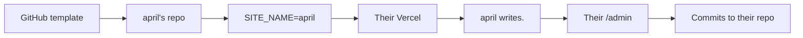

# The future product

An open-source **`{name} writes.`** gift — not a hosted service you maintain.

Friends (and an MDes class) fork or use a GitHub template, set their name, deploy their own site, and get **april writes.** or **bradley writes.** that they own. You distribute the spell; you do not run their journals.

Map of forks: `where-this-could-go.md`. Personal portfolio path: `portfolio-roadmap.md`.

Do not build the packaging yet. This is a note for later.

## Shape

Each person gets **one site, one repo, one deploy**. Git-as-CMS stays — it is the right model when each writer owns their files. The gift is making spin-up boring enough for classmates: template → name → env → deploy → first post.

This is the opposite of a multi-tenant host. No shared database. No names to claim on your infrastructure. No on-call for other people’s sites.

A hosted “type your name and you’re live” app remains a different ambition (see Deliberately later). It is not this fork.

## Keep

- `{name} writes.` as the identity (not “April’s Blog”)
- Journals as rooms, posts as a scrollable feed
- Quiet type, marks, light/dark, plain empty states
- Markdown writing with the existing toolbar
- Admin that commits Markdown to *their* GitHub
- Words living as files they can leave with (the repo *is* the export)

## Change (from this personal repo → giftable template)

| Today (pandji writes.) | Gift template |
| --- | --- |
| Hardcoded `pandji writes.` in `site.ts` | Config: display name + author from env or `site.config` |
| `GITHUB_REPO=apandji/pandji-writes` | Their fork / new repo from template |
| Seed journals and posts about your work | Empty or one sample journal; no your content |
| README aimed at you | Short “make it yours” guide for non-git-native designers |
| One living site | Many independent sites that happen to share a lineage |

## Core features of the gift

**Use the template.** GitHub Template Repository (or a clearly documented fork). One click → their repo. Prefer template over “clone and re-origin” so the first step feels like receiving a gift.

**Name it.** One place to set the public identity: `april writes.` Display string and short author name. Slug can default from the name for titles; the URL is whatever they connect on Vercel (`april-writes.vercel.app` is fine for class; custom domain later).

**Deploy path that fits class.** Documented happy path: Template → Vercel Import → set env vars → deploy. Aim for a classmate who has GitHub and a Vercel account to reach a public empty journal without editing application code.

**Write immediately after setup.** `/admin` with username/password in *their* env. Same desk: journals, posts, images, Mermaid, drafts. First journal can be seeded as `journal` or created in admin.

**Own the words by default.** Their Markdown, their uploads, their git history. No lock-in ceremony — leaving is `git clone`.

**It looks like writing, even empty.** Ship the quiet empty states and marks. The gift is the *feel*, not a theme marketplace.

**Class distribution.** A short handout or README section: what this is, why journals-as-rooms, the five setup steps, where to change the name, how to publish a first post, how to share the URL with critique partners. Optional: a tiny gallery page *you* keep of classmates who opt in (links only) — not a network inside the template.

## Connection model (keep thin)

Same three layers as the portfolio thinking — the gift stays on the hard layer.

| Layer | In the gift? | Notes |
| --- | --- | --- |
| **Rooms (journals)** | Yes — core | Membership and navigation. Do not replace with tags. |
| **Metadata** | Minimal | Title, date, draft, journal. No CMS field farm. |
| **Fuzzy links** | Out of scope for v1 | `kin` / motifs are portfolio corpus tools; classmates start with one room and a feed |

If someone grows a large personal corpus, they can follow `portfolio-roadmap.md` on *their* fork. The template should not ship portfolio CMS complexity.

## What you owe friends (and what you don’t)

**You owe:** a clear template, a name config, a setup guide that works, occasional upstream fixes you choose to merge into the template, and the reading/writing feel.

**You don’t owe:** hosting, uptime, password resets, content moderation, a shared directory, or merging every classmate’s feature request into your personal portfolio repo.

Keep the template repo separate from `pandji-writes` when you gift it — your portfolio and the class tool should not share one main branch forever.

## Deliberately later

- Hosted multi-tenant “claim a name on your domain” (different product; you become the host)
- Magic link / passkey auth (env password is enough when they own the deploy)
- One-click deploy button polish, Docker, or non-Vercel paths before the Vercel path is proven in class
- Themes beyond light/dark
- Collaboration / multi-author rooms
- Portfolio types (projects, talks) inside the template
- Motif taxonomies, discovery feed, follows
- A required public registry of all `{name} writes.` sites

Optional later gift: “Update from upstream” notes for classmates who want desk improvements without rebuilding.

## What would break the spell

Making *you* the host of everyone’s writing. A setup that requires editing five source files to change the name. Shipping a dashboard of other classmates’ posts on their homepage. Turning the template into a mini portfolio CMS. Forcing GitHub expertise beyond “use template + import to Vercel.” Asking them to pay you. Rebuilding *your* personal site on every friend’s experiment.

## First slice, if this is ever packaged

1. Extract or duplicate into a clean template repo (no personal posts).
2. `SITE_NAME` / author config driving `{name} writes.` everywhere (including admin chrome).
3. README: five steps for MDes classmates (template → Vercel → env → name → first post).
4. One sample journal, empty of your voice.
5. Hand to 2–3 friends before the whole class.

That is enough to gift. Hosting many writers on one app is a different story — only if the template spreads and people ask for zero-setup.
